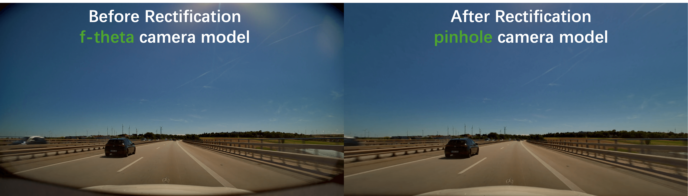

# Cosmos-Drive-Dreams Toolkits
This sub-repo provides toolkits for:

* A rendering script that converts RDS-HQ datasets into input videos (LiDAR and HDMAP) compatible with [**Cosmos-Transfer1-7B-Sample-AV**](https://github.com/nvidia-cosmos/cosmos-transfer1/blob/main/examples/inference_cosmos_transfer1_7b_sample_av.md) and [**Cosmos-Transfer1-7B-Sample-AV-Multiview**](https://github.com/nvidia-cosmos/cosmos-transfer1/blob/main/examples/inference_cosmos_transfer1_7b_sample_av_single2multiview.md).

* A conversion script that converts open-source datasets (e.g., Waymo Open Dataset) into RDS-HQ format, so you can reuse the rendering script to render the input videos.

* An interactive visualization tool to visualize the RDS-HQ dataset and generate novel ego trajectories.

<div align="center">
  
</div>

## Visualize Dataset
You can use `visualize_rds_hq.py` to visualize the RDS-HQ dataset. It would be helpful to see our example data first.
```bash
usage: visualize_rds_hq.py -i RDS_HQ_FOLDER -c CLIP_ID
                          [-np NOVEL_POSE_FOLDER] 
                          [-d {rds_hq_mv,...}] 

required arguments:
  -i RDS_HQ_FOLDER, --input_root RDS_HQ_FOLDER
                        The root folder of the RDS-HQ dataset, 
                        or other datasets converted to RDS-HQ format.

  -c CLIP_ID, --clip_id CLIP_ID
                        Specific clip id to visualize.

optional arguments:
  -np NOVEL_POSE_FOLDER, --novel_pose_folder NOVEL_POSE_FOLDER
                        Folder name for saving novel ego trajectories.
                        Default: novel_pose
                        
  -d {rds_hq_mv,...}, --dataset {rds_hq_mv,...}
                        dataset config name, refer to `config/dataset_<dataset_name>.json`
                        We will generate pose for 'CAMERAS' in `config/dataset_<dataset_name>.json`
                        Default: rds_hq_mv
                      
```
This python script will launch a [viser](https://github.com/nerfstudio-project/viser) server to visualize the 3D HD map world with dynamic bounding boxes. You can use 
- `w a s d` to control camera's position
- `q e` to control camera's z-axis coordinate


> [!NOTE]
> You can run this script on a **remote server** with VS Code + remote-ssh plugin. VS Code will automatically forward the port of viser to the local host. 


## Rendering Input Control Videos for Cosmos
You can use `render_from_rds_hq.py` to render the HD map + bounding box / LiDAR condition videos from RDS-HQ dataset. GPU is required for rendering LiDAR.
```bash
usage: render_from_rds_hq.py [-h] -i INPUT_ROOT -o OUTPUT_ROOT
                            [-cj CLIP_ID_JSON] 
                            [-d {rds_hq,rds_hd_mv,waymo,waymo_mv}]
                            [-c {pinhole,ftheta}] 
                            [-s hdmap] [-s lidar]
                            [-p] 
                            [-np NOVEL_POSE_FOLDER]

required arguments:
  -i RDS_HQ_FOLDER, --input_root RDS_HQ_FOLDER
                        The root folder of the RDS-HQ dataset, 
                        or other datasets converted to RDS-HQ format.
  
  -o OUTPUT_ROOT, --output_root OUTPUT_ROOT
                        Output directory

optional arguments:
  -cj CLIP_ID_JSON, --clip_id_json CLIP_ID_JSON
                        Specific clip(s) to process:
                        Choice 1: path to a json file containing expected clip ids
                        Choice 2: clip id string (render only one clip)
                        Choice 3: None (render all clips in the dataset)
                        Default: None
  
  -d {rds_hq,rds_hd_mv,waymo,waymo_mv}, --dataset {rds_hq,rds_hd_mv,waymo,waymo_mv}
                        Dataset configuration (default: rds_hq), refer to `config/dataset_<dataset_name>.json`
                        
  -c {pinhole,ftheta}, --camera_type {pinhole,ftheta}
                        Camera model type:
                        RDS-HQ dataset use ftheta model while waymo dataset use pinhole model
                        Default: ftheta
  
  -s hdmap, --skip hdmap
                        Skip HD Map rendering
  
  -s lidar, --skip lidar
                        Skip LiDAR rendering
  
  -p POST_TRAINING, --post_training POST_TRAINING
                        Also generate RGB video clip for post-training
                        Default: False
  
  -np NOVEL_POSE_FOLDER, --novel_pose_folder NOVEL_POSE_FOLDER
                        If provided, we will use pose in this folder as the novel ego trajectory.
                        If None, we will use the default pose in `pose` folder.
                        Default: None
```
This will automatically launch multiple jobs based on [Ray](https://docs.ray.io/en/releases-2.4.0/index.html). If you want to use single process (e.g. for debugging), you can set `USE_RAY=False` in `render_from_rds_hq.py`. You can add `--skip hdmap` or `--skip lidar` to skip the rendering of HD map and LiDAR, respectively. 

**RDS-HQ Rendering Results**
<div align="center">
  
</div>

> [!NOTE]
> If you're interested, we offer [documentation](../assets/ftheta.pdf) that explains the NVIDIA f-theta camera in detail.


The output folder structure will be like this. Note that `videos` will only be generated when setting `--post_training true`.
```bash
<OUTPUT_FOLDER>
├── hdmap
│   └── {camera_type}_{camera_name}
│       ├── <CLIP_ID>_0.mp4
│       ├── <CLIP_ID>_1.mp4
│       └── ...
│
├── lidar
│   └── {camera_type}_{camera_name}
│       ├── <CLIP_ID>_0.mp4
│       ├── <CLIP_ID>_1.mp4
│       └── ...
│
└── videos
    └── {camera_type}_{camera_name}
        ├── <CLIP_ID>_0.mp4
        ├── <CLIP_ID>_1.mp4
        └── ...
```


## Generate Novel Ego Trajectory
You can use `visualize_rds_hq.py` to generate novel trajectories.
```bash
visualize_rds_hq.py -i RDS_HQ_FOLDER -c CLIP_ID
                    [-np NOVEL_POSE_FOLDER] 
                    [-d {rds_hq_mv,...}] 
```
A detailed explanation of each argument can be found above. Using the panel on the right, you record keyframe poses (make sure include the first frame and the last frame), and the script will interpolate all intermediate poses and save them as a `.tar` file in the `NOVEL_POSE_FOLDER` folder at `RDS_HQ_FOLDER`. Then you can pass `--novel_pose_folder <NOVEL_POSE_FOLDER>` to the rendering script `render_from_rds_hq.py` to use the novel ego trajectory.
```bash
python render_from_rds_hq.py -i RDS_HQ_FOLDER -o OUTPUT_FOLDER -cj CLIP_ID -np NOVEL_POSE_FOLDER
```

## Convert Public Datasets

We provide a conversion and rendering script for the Waymo Open Dataset as an example of how information from another AV source can interface with the model. 

[Convert Waymo Open Dataset](./docs/convert_public_dataset.md)

**Waymo Rendering Results (use ftheta intrinsics in RDS-HQ)**


**Waymo Rendering Results (use pinhole intrinsics in Waymo Open Dataset)**


**Our Model with Waymo Inputs**
<div align="center">
  
</div>


## Rectify f-theta Camera to Pinhole Camera
Pinhole camera model is a more widely used camera model, and we can rectify the $f$-theta camera to it. This requires `ftheta_intrinsic` and `pinhole_intrinsic` from RDS-HQ dataset. Then you can convert a cosmos-generated video or real-world RDS-HQ video to pinhole camera model.

```bash
python rectify_ftheta_to_pinhole.py -i INPUT_VIDEO_PATH -o OUTPUT_ROOT -r RDS_HQ_FOLDER -c CLIP_ID [-n CAMERA_NAME]


required arguments:
  -i INPUT_VIDEO_PATH, --input_video_path INPUT_VIDEO_PATH
                        Path to source ftheta video file requiring rectification.
                        Can be a cosmos-generated video or a real-world RDS-HQ video.
  
  -o OUTPUT_ROOT, --output_root OUTPUT_ROOT
                        Directory for rectified outputs.
  
  -r RDS_HQ_FOLDER, --rds_hq_folder RDS_HQ_FOLDER
                        Path to RDS-HQ dataset root.
  
  -c CLIP_ID, --clip_id CLIP_ID
                        Clip id (to query the ftheta_intrinsic and pinhole_intrinsic)
                        

optional arguments:
  -n CAMERA_NAME, --camera_name CAMERA_NAME
                        Camera name to use (default: camera_front_wide_120fov)

```

After rectification, we will have some quality degradation and pixel loss. Typically, the field of view (FOV) will also be reduced. See the difference below:


## Prompting During Inference
We provide a captioning modification example to help users reproduce our results. Please refer to [prompt rewriter](https://github.com/nv-tlabs/Cosmos-Drive-Dreams/tree/main?tab=readme-ov-file#2-prompt-rewriting).
